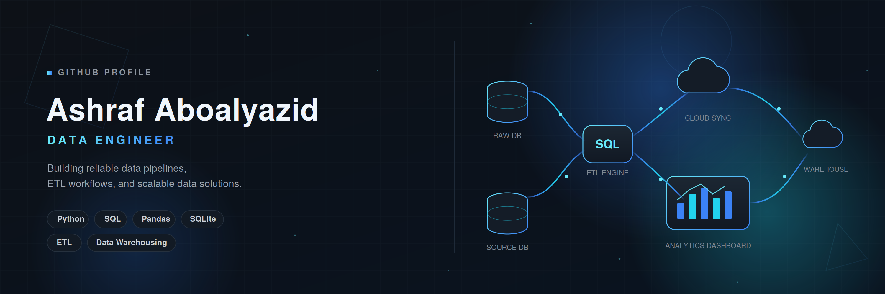

# Hi, I'm Ashraf Aboalyazid 👋

### Data Engineer

Building reliable data pipelines and scalable data solutions.

---

# 🚀 About Me

I'm passionate about building robust ETL pipelines, designing scalable data architectures, and automating data workflows.

My interests include:

- Data Engineering
- ETL Pipelines
- Data Warehousing
- SQL Optimization
- Workflow Automation
- Cloud Data Engineering

---

# 🛠 Tech Stack

---

# 📌 Featured Projects

### 🏦 Largest Banks ETL Pipeline

- Extract data from Wikipedia
- Transform market capitalization into multiple currencies
- Store data in SQLite
- Execute SQL queries
- Log ETL workflow

**Tech:** Python • Pandas • BeautifulSoup • SQLite

---

### 🏗 SQL Data Warehouse

Modern SQL Server data warehouse with dimensional modeling, ETL workflows, and analytics.

---

### 🌐 Portfolio Website

Personal portfolio showcasing projects, technical skills, and certifications.

---

# 📊 GitHub Analytics

---

# 🎯 Current Focus

- Apache Airflow
- Docker
- Spark
- Azure Data Engineering
- Data Modeling
- Production ETL Pipelines

---

# 📫 Connect

---

> **"Clean Data. Clean Code. Better Decisions."**

⭐ Thanks for visiting my profile.

